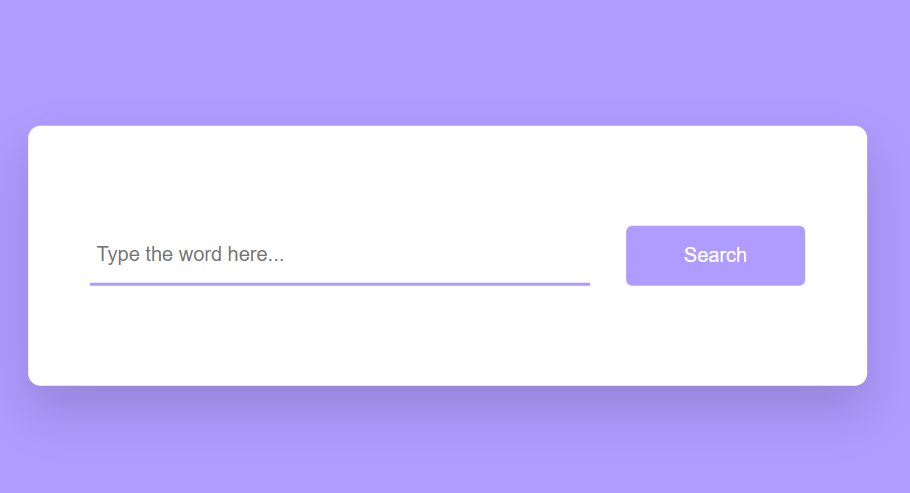
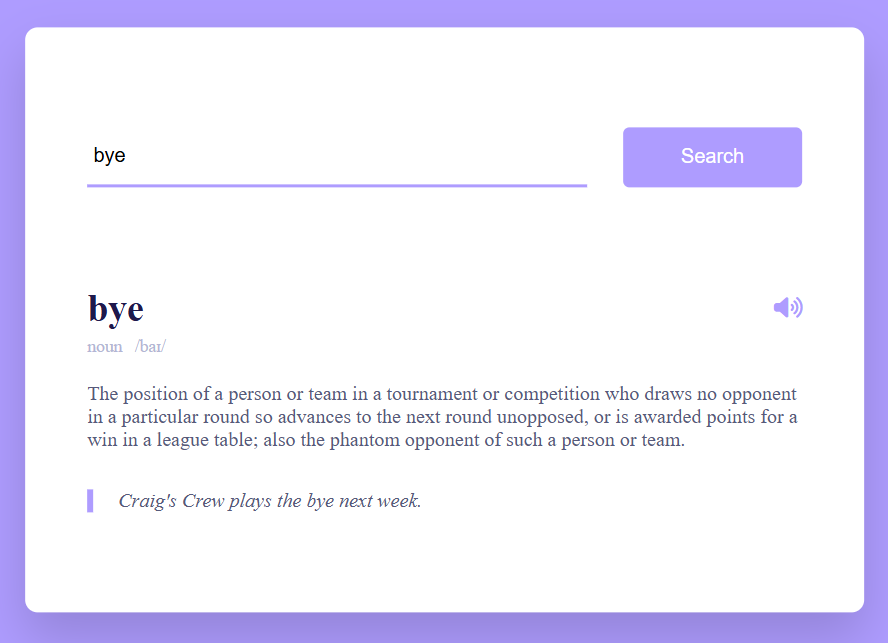
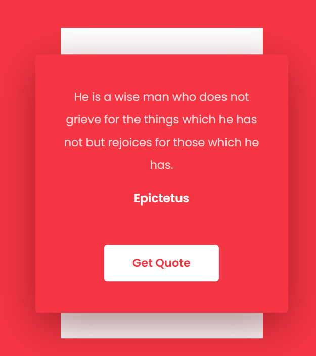
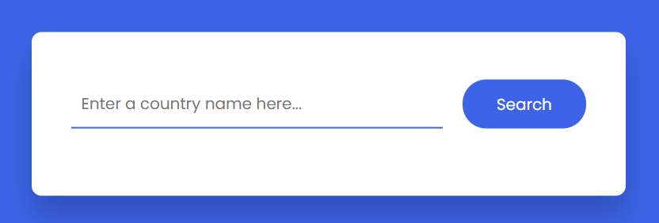
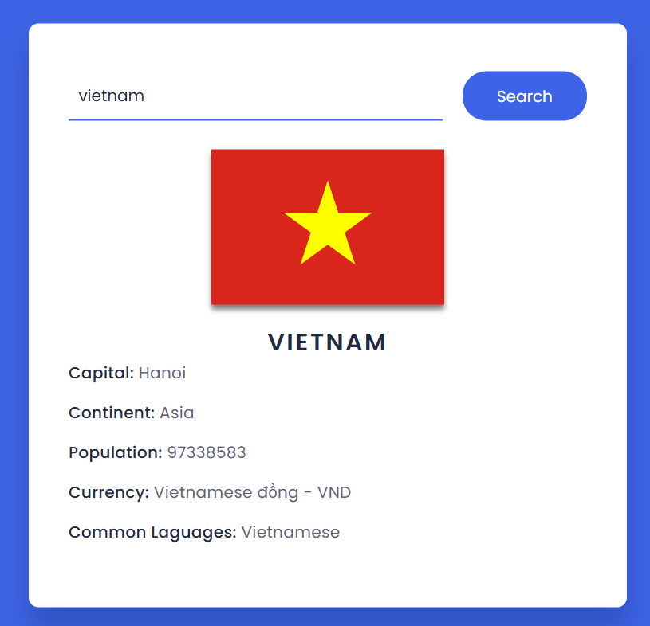

# Luyện tập Javascpit

Ở đây tôi sẽ luyện tập cách call API bằng ngôn ngữ Javascript.

## 1. Joke Random
- Get API: https://sv443.net/jokeapi/v2/
- Thành quả: Hiển thị được nội dung (Joke ^^!).
- Giao diện

- Kết quả

## 2. Dictionary App
- Get API: https://dictionaryapi.dev/
- Thành quả: Lấy được dữ liệu từ bàn phím và hiển thị được phiên âm, định nghĩa, ví dụ và cách đọc.
- Giao diện

- Kết quả

## 3. Random Quote
- Get API: https://api.quotable.io/random
- Github: https://github.com/lukePeavey/quotable?tab=readme-ov-file#get-random-quotes
- Thành quả: lấy được nội dung quote và tên tác giả sau đó hiển thị ra màn hình. Khi lần đầu vào thì cũng sẽ hiển thị quote thay vì không hiển thị gì
- Giao diện

## 4. Country Guide
- Get API: https://restcountries.com/
- Thành quả: Lấy được dữ liệu của các nước được nhập vào ô input, hiển thị thông báo nếu không nhập hay nhập sai.
- Giao diện

- Kết quả
